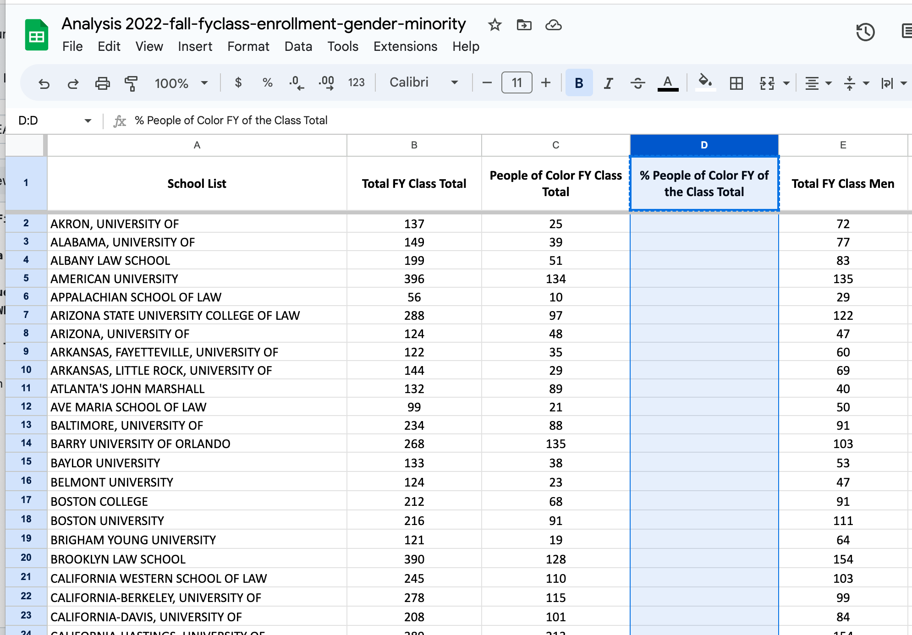
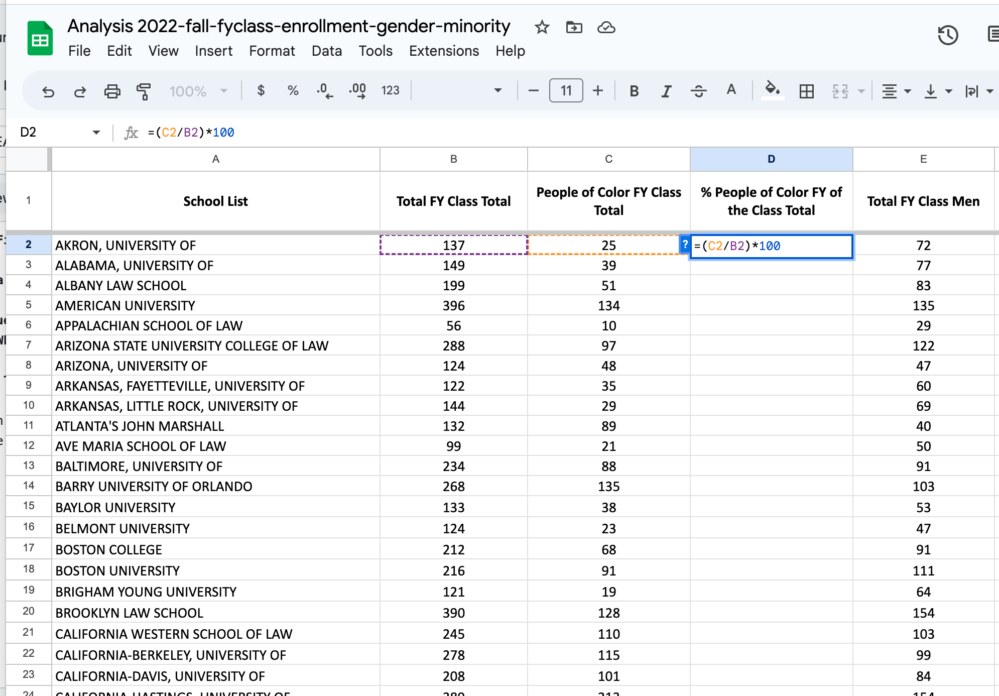
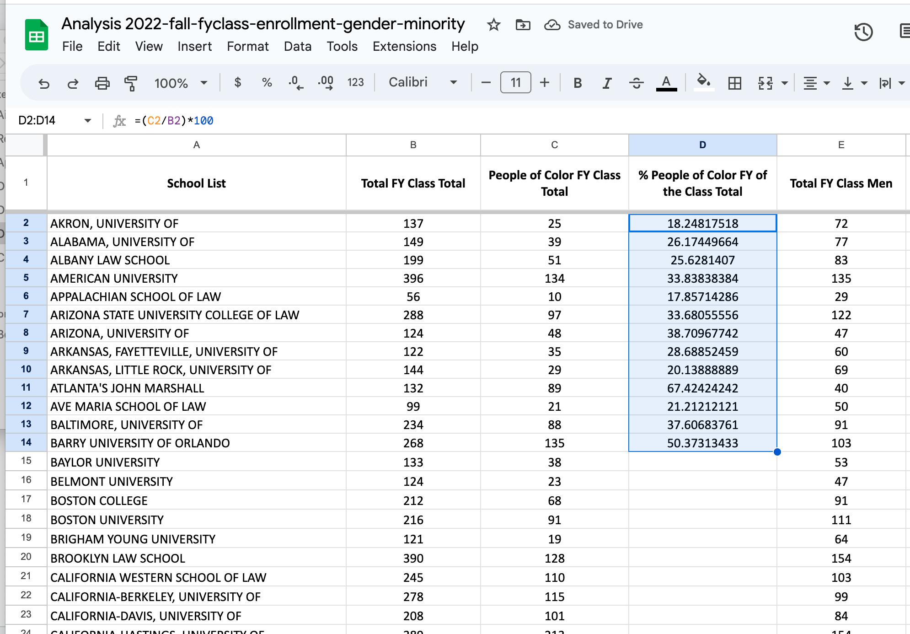
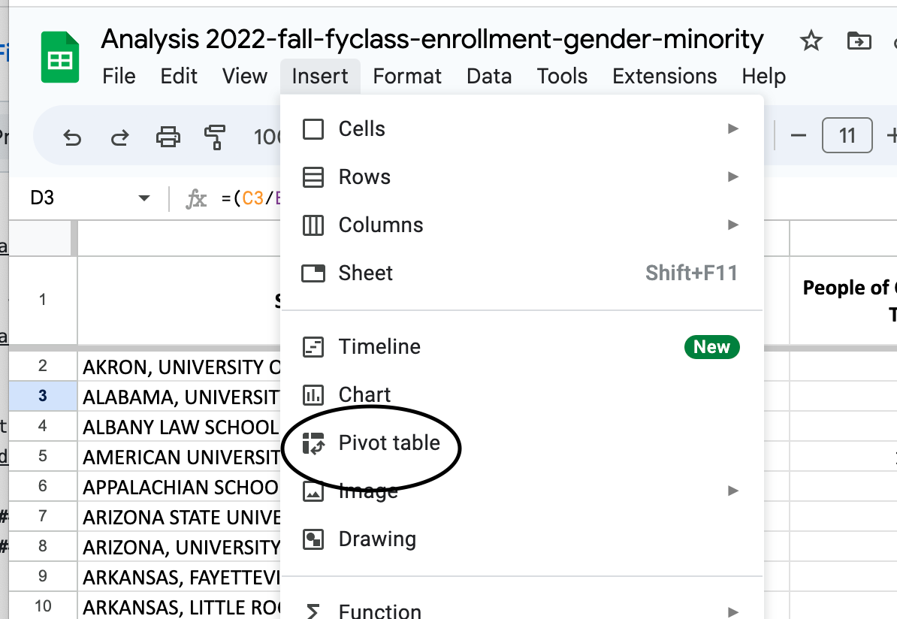
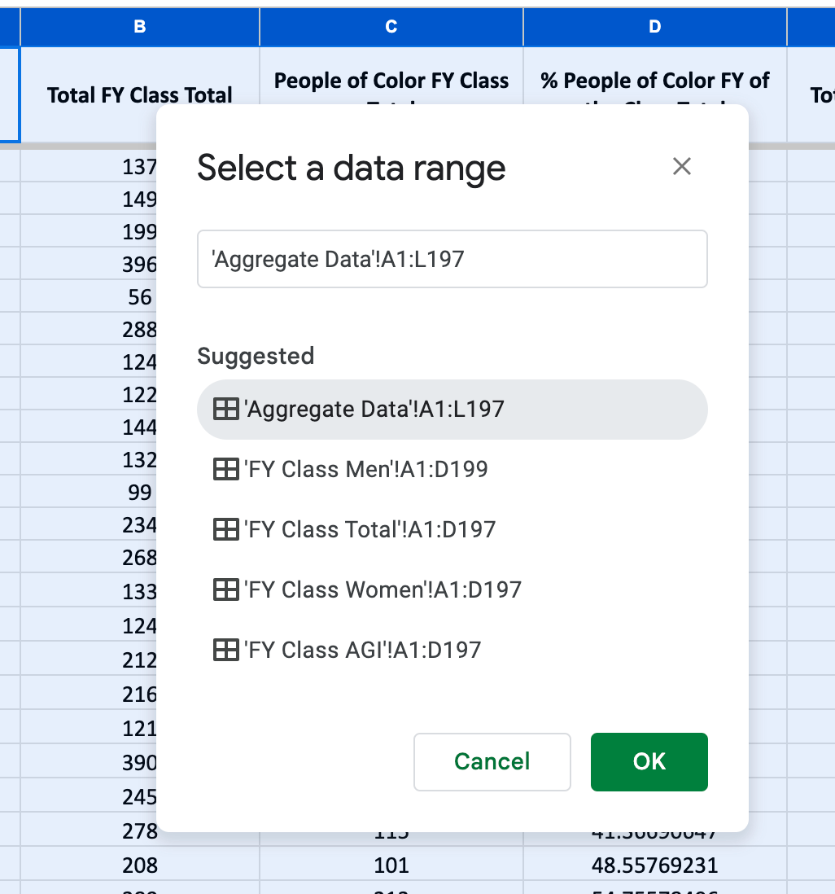
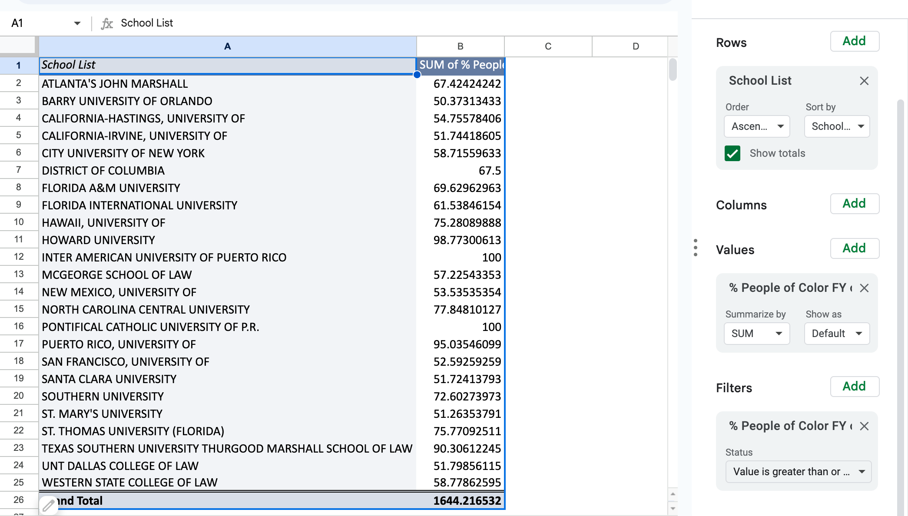
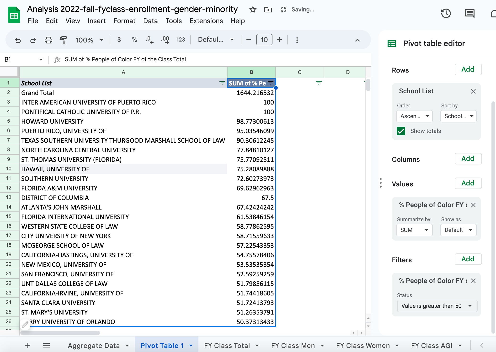

# J124Final

## Data Analysis 

## Sources

| **Carol Stevens**                                      | **Director, Media Relations & Strategic Communications**                                                                                                                                                                                                                                                                                                                                                           |
|---------------------------------------------------|-------------------------------------------------------------------------------------------------------------------------------------------------------------------------------------------------------------------------------------------------------------------------------------------------------------------------------------------------------------------------------|
|Phone:|202-662-1095
|Email| carol.stevens@americanbar.org|
|Why?| Director Stevens is the contact for Media and Journalism regarding all American Bar Association statistics. She can shed light on the willingness |

| **Carol Stevens**                                      | **Director, Media Relations & Strategic Communications**                                                                                                                                                                                                                                                                                                                                                           |
|---------------------------------------------------|-------------------------------------------------------------------------------------------------------------------------------------------------------------------------------------------------------------------------------------------------------------------------------------------------------------------------------------------------------------------------------|
|Phone:|202-662-1095
|Email| carol.stevens@americanbar.org|
|Why?| Director Stevens is the contact |

## Additional Sources

1. [2022 Law School Enrollment by Race & Ethnicity](Law_School_Enrollment_by_Race_&_Ethnicity_(2022).pdf)
* This source is a journalistic piece from Enjuris that uses data to break down the statistics regarding "Racially-Ethnic Minority" students attending law school. It shows more insight into the specific ethnicities the students identify with where they are concentrated in the United States.

2. [2022 Law School Enrollment by Race & Ethnicity](LGBTQ_Bar's_Law_School_Campus_Climate_Survey-2021_The_National_LGBTQ_Bar_Association)

### Question 1 
#### *What percentage of the 2022 incoming law school students are people of color?*

###### The Break Down: 

1. Open the file in google sheets and label a new column "% People of Color FY of the Class Total."

2. Type in the formula "=(C2/B2)*100" (cell location may vary depending on sheet edits)

3. Click the cell with the formula and drag the formula down by clicking and holding the bottom right circle of the cell. Drag the formula until the last cell of data.

###### The Answer: 

### Question 2
#### *Which of the law schools had the highest percentage of incoming students of color in 2022?*

###### The Break Down:

1. Using the data gathered from question 1, we are going to create a pivot table.
2. In the tool bar at the top of the sheet, click "insert" and then select the "pivot table" option from those displayed.  

3. When prompted to create a pivot table, you must "input the data range." Fill out the data range as follows: '{insert sheet name}'!{insert first cell of data}:{insert last cell of data}.
In our case, it should look like the following: 

4. Before clicking the button "create" to create the pivot table, make sure to create it on a "new sheet." That sheet will then open with the pivot table. You must add qualifiers under the "pivot table editor" to add data to your pivot table. Under "Rows," add "School list" and under "Values" add "% People of Color FY of the Class Total." Lastly, to display only those with a greater percentage, add a "filter" of the "% People of Color FY of the Class Total" of "greater than 50." This way, only the school with 50% or more will be displayed.
Your pivot table should then look like this: 

5. Lastly, double-click the top left corner right where the "1" row title and "A" column title meet. Then select "create filter" of the options presented. Then click the funnel or upside-down triangle on the right bottom corner of the title cell "% People of Color FY of the Class Total." You must then click the Z->A option, as it will present the percentages in order of greatest to least.
Your final pivot table will look like this:
 

###### The Answer: 

### Question 3
#### *What percentage of the 2022 incoming law school students are people of color?*

###### The Break Down:

###### The Answer: 

### Question 4
#### *What percentage of the 2022 incoming law school students are people of color?*

###### The Break Down:

###### The Answer: 

### Question 5
#### *What percentage of the 2022 incoming law school students are people of color?*

###### The Break Down:
