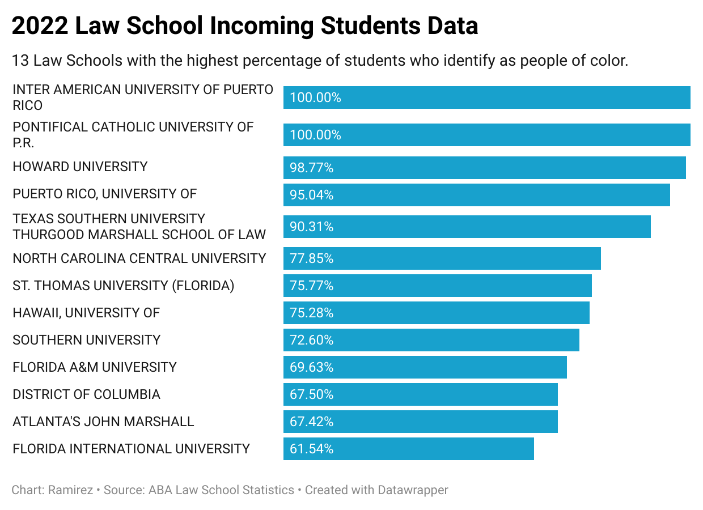
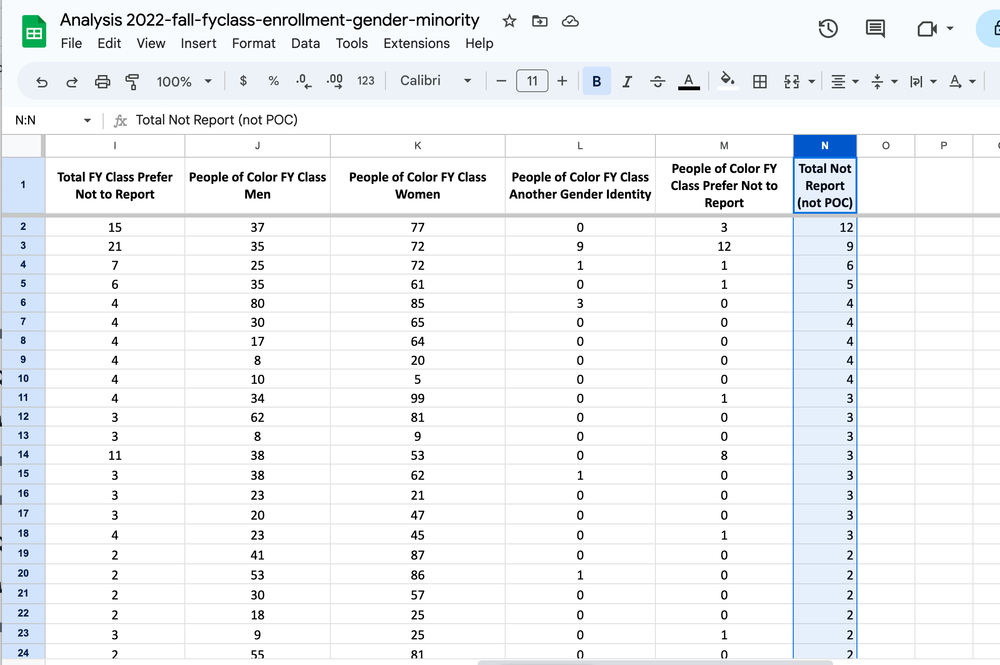

# J124Final - Diversity in Law Schools

## Story Pitch 

Diversity in law schools is a difficult thing to measure. Throughout this piece, we will undercover some statistics that allow us to 

## Data Utilized 
[Data on 2022 Fall Class Incoming Students - Provided by the ABA Statistics](2022-fall-fyclass-enrollment-gender-minority.xlsx)

## Data Visualization
### Bar Graph

[Data on 2022 Fall Class Incoming Students](https://datawrapper.dwcdn.net/e5kKG/1/)

## Sources

| **Carol Stevens**                                      | **Director, Media Relations & Strategic Communications**                                                                                                                                                                                                                                                                                                                                                           |
|---------------------------------------------------|-------------------------------------------------------------------------------------------------------------------------------------------------------------------------------------------------------------------------------------------------------------------------------------------------------------------------------------------------------------------------------|
|Phone:|202-662-1095
|Email| carol.stevens@americanbar.org|
|Why?| Director Stevens is the contact for Media and Journalism regarding all American Bar Association statistics. She can shed light on the changes that may occur in the statistics over the years, students' willingness to participate and answer honestly, and any trends that can be observed from her position. |

| **Billy Curtis**                                      | **Director, Gender Equity Resource Center, Berkeley Law**                                                                                                                                                                                                                                                                                                                                                           |
|---------------------------------------------------|-------------------------------------------------------------------------------------------------------------------------------------------------------------------------------------------------------------------------------------------------------------------------------------------------------------------------------------------------------------------------------|
|Phone:|510-643-0788 
|Email| billyc@berkeley.edu|
|Why?| As director of the Gender Equity Resource Center, Mr. Curtis can provide insight into the reality of attending Berkeley Law as a part of the LGBT+ community. Interacting with a range of law students and providing their gender identity resources, he can provide a comparison of what some law schools may offer to the community versus others. |

## Additional Sources

1. [2022 Law School Enrollment by Race & Ethnicity](Law_School_Enrollment_by_Race_&_Ethnicity_(2022).pdf)
* This source is a journalistic piece from Enjuris that uses data to break down the statistics regarding "Racially-Ethnic Minority" students attending law school. It shows more insight into the specific ethnicities the students identify with where they are concentrated in the United States.

2. [LGBTQ Bar's Law School Campus Climate Survey-2021 The National LGBTQ Bar Association](https://lgbtqbar.org/climate-survey/climate-survey-2021/)
* This survey created by the LGBTQ+ Bar Association is a surgery that is completed by over 110 law schools and their students. It describes in detailed questions how students in each law school identify, if any faculty belong to the community, and even more data, such as health care regarding the community.

### Question 1
#### *Which school had the highest number of students who did not report data and these students were not students of color?*

###### The Break Down:

1. Double-click the top of a column to add another column to the right labeled "Total Not Report (not POC nor Another Gender Identity)."
2. Click the first cell and type in the formula =((Total FY Class Prefer Not to Report)-(People of Color FY Class Prefer Not to Report)). In my sheet, this would be "=I2-M2."
3. Lastly, click the top of the newly created column. On the bottom right of the topmost cell, there will be an arrow pointing downward or an upside-down triangle. After clicking that button, select "sort sheet Z->A." This will arrange the values from highest to lowest.
Resulting in the following:

###### The Answer: UNIVERSITY OF ILLINOIS CHICAGO SCHOOL OF LAW = 12 students

### Question 2 
#### *What percentage of the 2022 incoming law school students are people of color?*

###### The Break Down: 

1. Open the file in google sheets and label a new column "% People of Color FY of the Class Total."

2. Type in the formula "=(C2/B2)*100" (cell location may vary depending on sheet edits)

3. Click the cell with the formula and drag the formula down by clicking and holding the bottom right circle of the cell. Drag the formula until the last cell of data.

###### The Answer: Column D now has all the percentages of incoming law school students who identify as people of color.

### Question 3
#### *Which of the law schools had the highest percentage of incoming students of color in 2022?*

###### The Break Down:

1. Using the data gathered from question 1, we are going to create a pivot table.
2. In the tool bar at the top of the sheet, click "insert" and then select the "pivot table" option from those displayed.  

3. When prompted to create a pivot table, you must "input the data range." Fill out the data range as follows: '{insert sheet name}'!{insert first cell of data}:{insert last cell of data}.
In our case, it should look like the following: 

4. Before clicking the button "create" to create the pivot table, make sure to create it on a "new sheet." That sheet will then open with the pivot table. You must add qualifiers under the "pivot table editor" to add data to your pivot table. Under "Rows," add "School list" and under "Values" add "% People of Color FY of the Class Total." Lastly, to display only those with a greater percentage, add a "filter" of the "% People of Color FY of the Class Total" of "greater than 50." This way, only the school with 50% or more will be displayed.
Your pivot table should then look like this: 

5. Lastly, double-click the top left corner right where the "1" row title and "A" column title meet. Then select "create filter" of the options presented. Then click the funnel or upside-down triangle on the right bottom corner of the title cell "% People of Color FY of the Class Total." You must then click the Z->A option, as it will present the percentages in order of greatest to least.
Your final pivot table will look like this:
 

###### The Answer: 

### Question 4
#### *What percentage of the 2022 incoming law school students are people of color?*

###### The Break Down:

###### The Answer: 

### Question 5
#### *What percentage of the 2022 incoming law school students are people of color?*

###### The Break Down:
